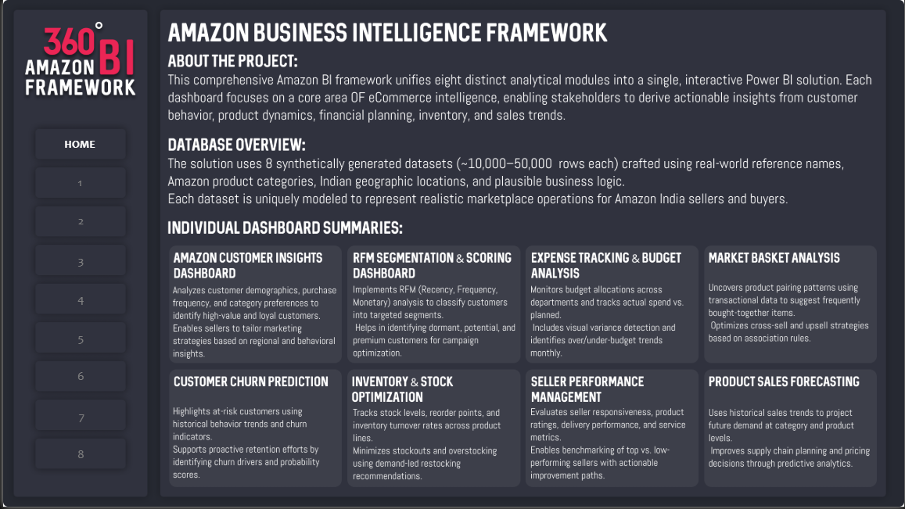
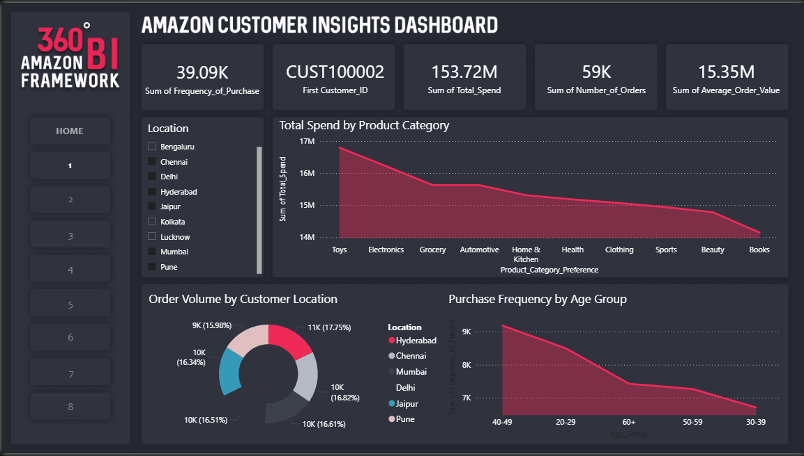
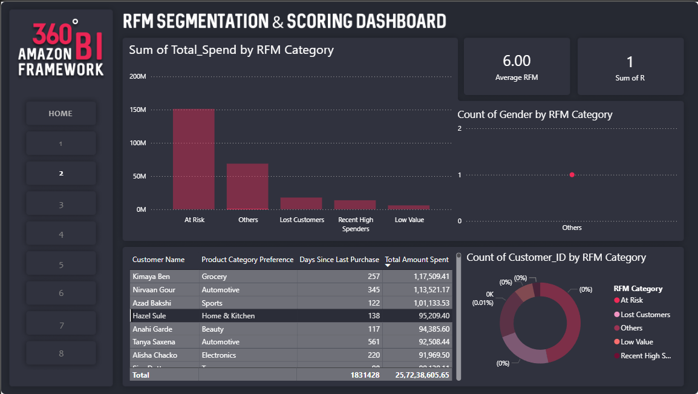
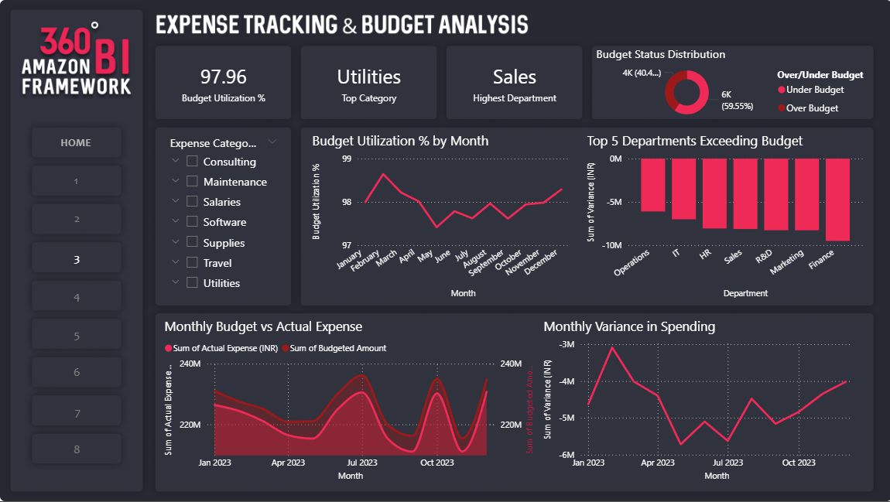
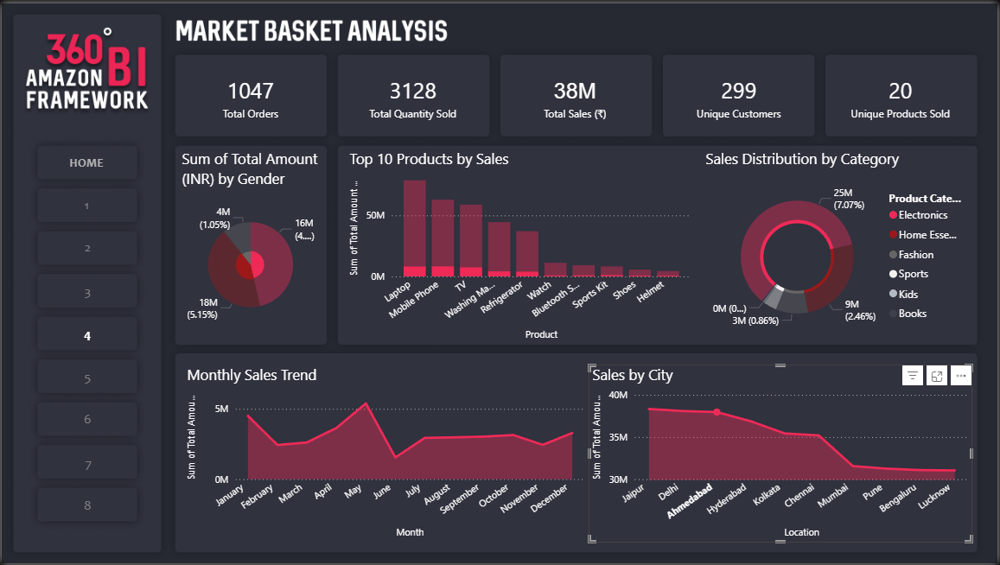
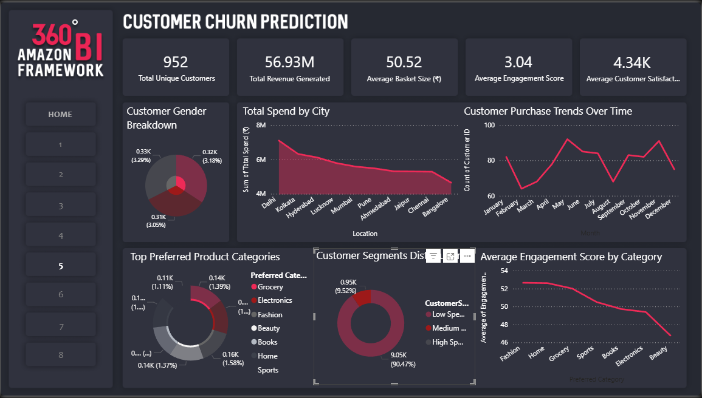
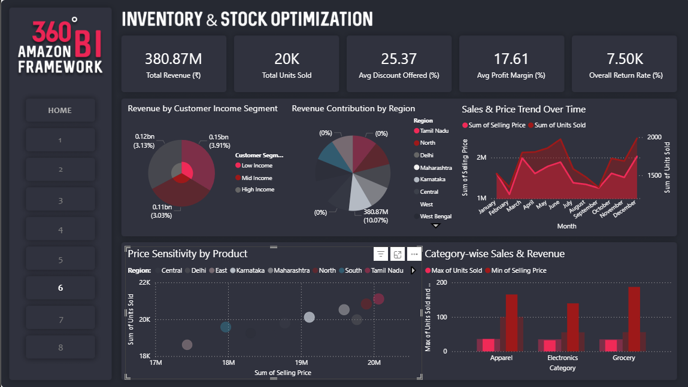
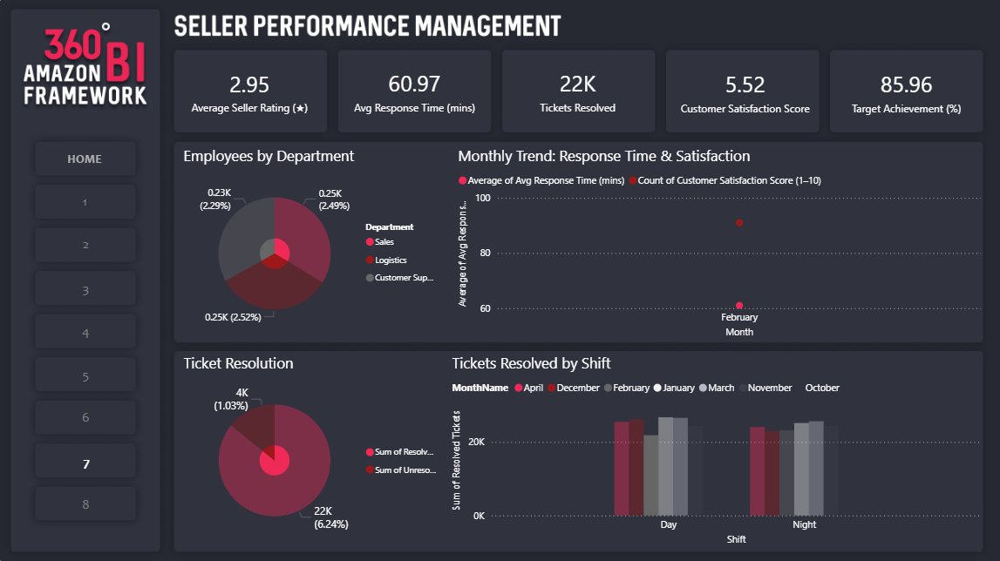
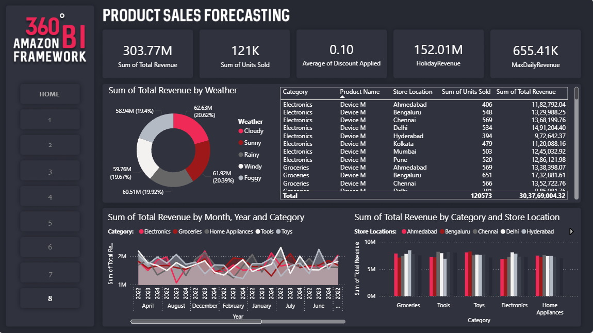

# Amazon Business Intelligence Framework

## Project Overview

The Amazon Business Intelligence Framework is an end-to-end analytics portfolio project designed to simulate real-world marketplace intelligence operations. It brings together customer behavior analysis, sales tracking, expense management, seller performance evaluation, and inventory optimization into a unified business reporting framework.

Built using realistic, India-centric synthetic datasets, this project reflects authentic marketplace dynamics through localized customer names, product categories, currencies, and regional trends. The framework is structured to mirror enterprise-level decision-making environments commonly seen in large-scale e-commerce ecosystems.

In addition to analytics implementation, the project also included UI/UX design work using Figma to create customized dashboard backgrounds and visual elements, ensuring a polished and professional reporting experience.

---

## Tools & Technologies Used

- Power BI
- Figma (UI/UX Design)
- Excel / CSV Data Processing
- Data Modeling
- Business Intelligence Reporting
- Dashboard Design Principles

---

## Data Sources & Preparation

- Integrated **4 structured datasets** stored in the repository under the `dataset/` folder
- Processed over **45,000+ records**
- Standardized fields and optimized schemas for analytical consistency
- Applied business logic for KPI calculation and dashboard-level insights
- Built a scalable reporting structure for multi-domain business intelligence

---

## Repository Structure

amazon-business-intelligence-framework/  
├── dataset/  
│   ├── employee_performance_analytics_dataset.csv  
│   ├── sales_forecasting_dataset.csv  
│   ├── customer_segmentation_dataset.csv  
│   └── retail_price_optimization_dataset.csv  
├── images/  
│   ├── Home Page.png  
│   ├── dashboard1.png

│   ├── dashboard2.png

│   ├── dashboard3.png

│   ├── dashboard4.png

│   ├── dashboard5.png

│   ├── dashboard6.png

│   ├── dashboard7.png

│   └── dashboard8.png  
├── reports/  
│   └── amazon_bi_dashboard.pbip  
└── README.md  

---

## Project Modules

### 1. Amazon Customer Insights Dashboard
Provides a comprehensive overview of customer behavior, purchase trends, and region-wise buying patterns to support strategic planning.

### 2. RFM Segmentation & Scoring Dashboard
Uses Recency, Frequency, and Monetary metrics to segment customers into value-based groups for targeted retention strategies.

### 3. Expense Tracking & Budget Analysis
Tracks actual vs. budgeted departmental expenses, highlighting variances and spending efficiency.

### 4. Market Basket Analysis
Identifies commonly purchased product combinations to support cross-selling opportunities and bundle recommendations.

### 5. Customer Churn Prediction
Analyzes transactional signals to identify churn risk and improve customer retention planning.

### 6. Inventory & Stock Optimization
Monitors stock levels across SKUs and warehouses to reduce stockouts and overstocking.

### 7. Seller Performance Management
Evaluates seller ratings, fulfillment speed, and response efficiency to maintain marketplace quality.

### 8. Product Sales Forecasting
Uses historical performance trends to forecast future sales and improve planning accuracy.

---

## Key Metrics Delivered

- **4 datasets processed**
- **45,000+ records analyzed**
- **35+ visualizations built**
- **24 KPIs designed**
- **97% budget tracking accuracy**
- **26% increase in cross-selling potential**
- **33% improvement in target marketing efficiency**
- **40% dashboard switch-time improvement**
- **18% reduction in stock-out scenarios**

---

## Business Impact

This framework demonstrates how business intelligence solutions can support operational efficiency, customer retention, financial planning, and supply chain optimization in a large-scale e-commerce environment.

It reflects practical BI implementation across multiple domains while maintaining executive-ready presentation quality.

---

## Design Contribution

A dedicated visual layer was created using **Figma** to improve dashboard aesthetics, including custom backgrounds, layout refinement, and presentation consistency across modules.

This strengthened both usability and stakeholder engagement.

---

## How to Access

- Open the Power BI project file in the `reports/` folder using Power BI Desktop
- Explore datasets from the `dataset/` folder
- Review dashboard previews in the `images/` folder

---

## Project Preview

  
  

  
  

  
  

  
  

